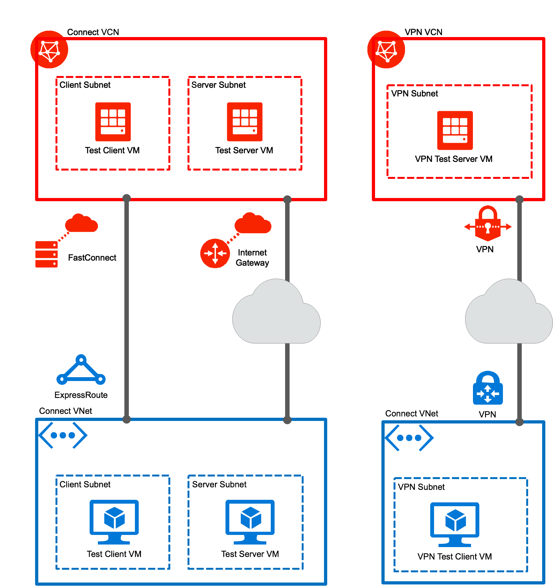

# Environment for testing latency of Microsoft Azure - Oracle Cloud (OCI) interconnect

Here you can find terraform scripts for setting up an environment for testing the interconnect between Azure and OCI. The various connection options you can evaluate with this environment include
- interconnect using FastConnect (OCI) and ExpressRoute (Azure)
- connect via public internet
- connect via VPN

Several VMs are set up with tooling for testing connectivity:
- iperf
- iperf3
- qperf
- sockperf

